# Authentication & Authorization in Express  

### Authentication
autrorization nanya kamu punya izin apa, punya wewenang apa  
data user semisal hanya bisadicek admin  
kalau ada izinkan data, kalau engga maka ngasih status code 403 dan message  
login make method post
berusaha mengenali, dan datanya ada maka dikasih token  

 

### Authorization  
nanya dia punya hak apa, semisal dia dmin, maka dia bisa mengakses data si user  

 

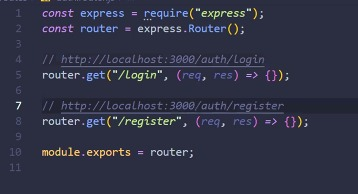  

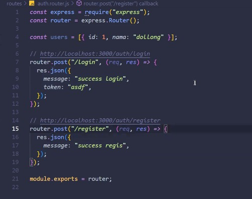  

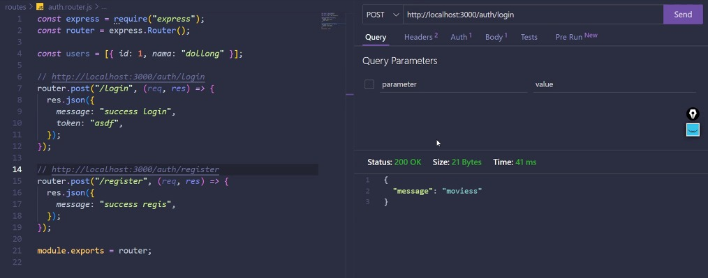  

token itu tanda pengenal, isinya cuman id user (brda2 tiap org)  

token dibawa kembali ke login, fe akan menyimpan di local storarge  

ketika mengakses end point sekalian kirim data  

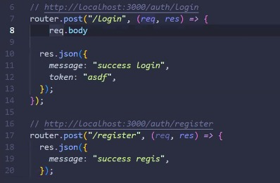   

>maka akan ditangkap disini  

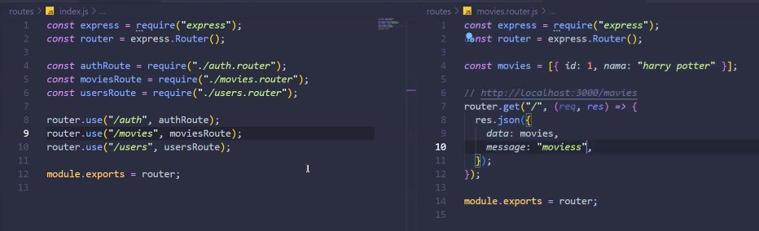  

>untuk movies nya  

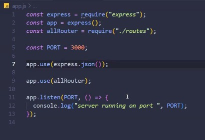   

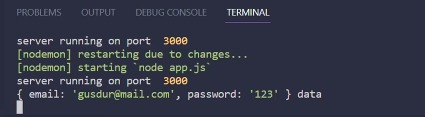  

>setelah diset up maka akan ada

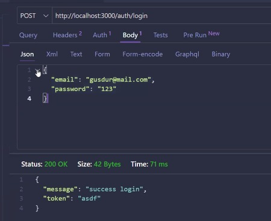  

>datanya dr sini

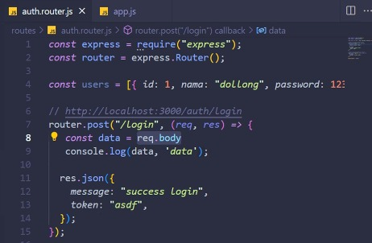  

>berhasil req data dr body  

sekarang ngecek apakah email dan pass nya bener  

selanjutnya dimanipulasi

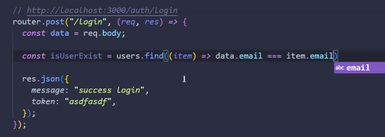  

>dengan cara

  

>apakah ini

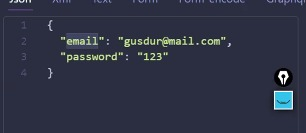  

>sama dengan ini, fungsi code tdi

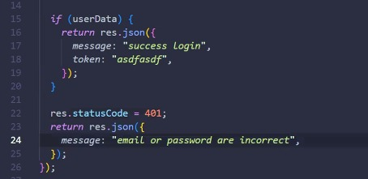  

>membuat return  

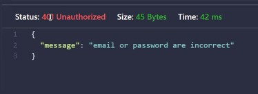  

>hasilnya, berhasil

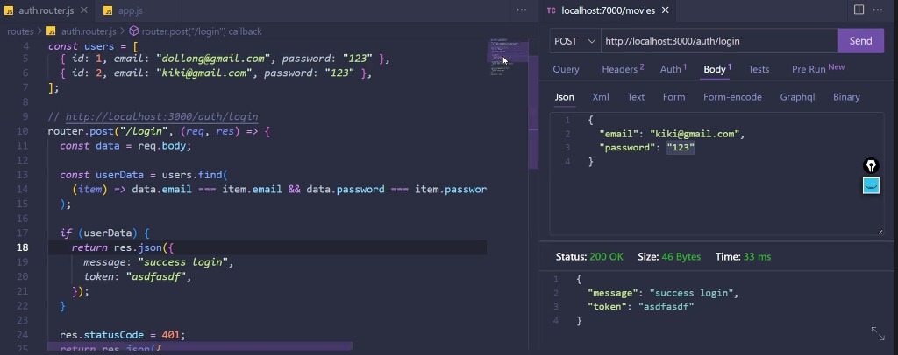  

>cth dia memeriksa email dan pass nya

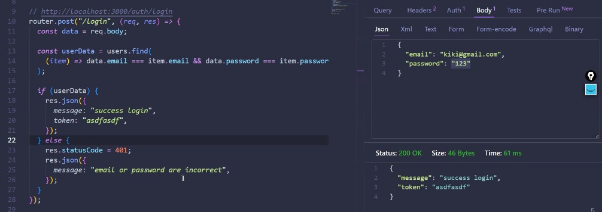 

>bisa juga make rest

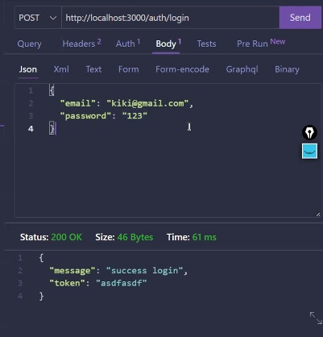 

>setiap mau ngirim data dan tambah data make method post

 

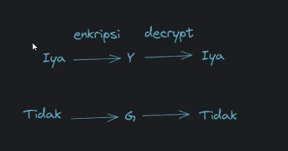  

>enkripsi, ubah bahasa formal ke bahasa sendri

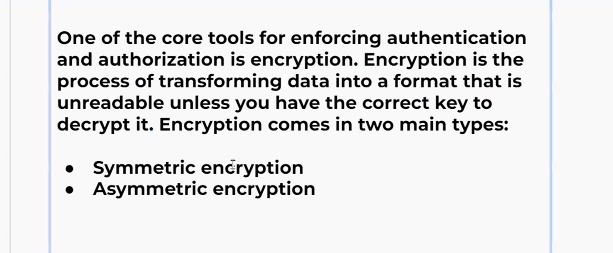 

>pengertian enkripsi

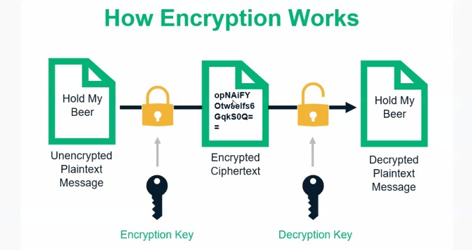  

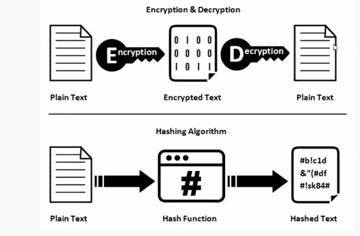 

>bedanya :encryption acak atau beda cara  
encryption bisa buat jd kata2 susah, bisa dibalikin dgn algoritma yg sama, cara yg sama  
hashing : ngacakin, beneran diacak, dibuatin format, ke format teks random  
hasing ada tambahan salt

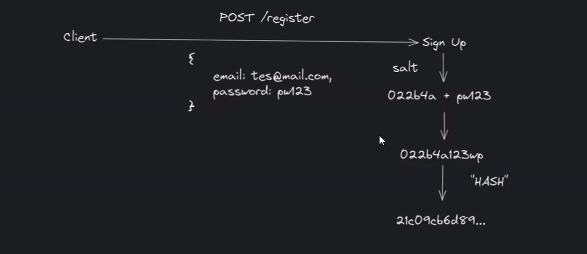  

>contoh hasing  
pass ditambah satu kata2 unik, satu kumpulan yg unik yg bisa berubah2

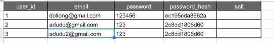  

>cth penggunaan hasing  
ketika ada pass yg sama maka encrypt nya sama, makanya susah digunakan  
jdi semisal nih dia make email ke 3 tp luap angka 2, dia berhasil masuk kalau make encrypt maka berhasil masuk, makanya make hasing agar dilakukan perbedaan  

 

token itu tanda penegnal, dengan bantuan jwt  
jwt ada masa expired nya, tokennya ada masa expired nya  
token itu gunanya biar siapapun yg melihat gk langsung liat datanya
