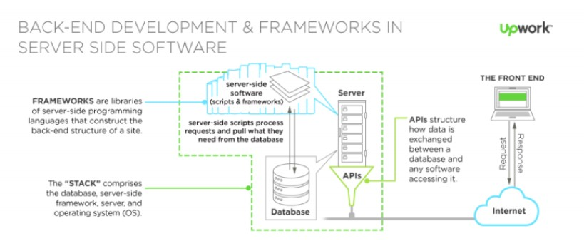

# Backend Development  
Back-end adalah bagian belakang “layar” dari sebuah website atau aplikasi.  
Secara teknologi, Back-end adalah segala macam teknologi yang ada di sisi server dari sebuah website atau aplikasi.  

 

### Bahasa Pemograman  
Back-end developers dapat memilih dari sekian banyak bahasa pemrograman dan framework, tetapi itu semua tergantung pada jenis aplikasi apa yang dibuat.  

  

 

### Servers : The Machinery  
Server adalah sebuah jaringan komputer yang menyediakan jenis layanan tertentu (service) pada komputer lain.  
Server juga dilengkapi dengan sistem operasi khusus, yang disebut sebagai Sistem Operasi Jaringan/Network Operating System.  
Secara sederhana, server bekerja atas permintaan dari sebuah klien.  

  

 

### Database : The Storage  
Database dapat didefinisikan sebagai kumpulan data yang disimpan secara sistematis di dalam komputer yang dapat diolah dan dimanipulasi.  
Lebih singkatnya Database bisa juga disebut sebagai gudang penyimpanan data untuk diolah lebih lanjut.  

 

### APIs: Application Programming Interfaces  
API adalah sekumpulan instruksi program dan protokol yang digunakan untuk membangun aplikasi perangkat lunak.  
REST API bertugas sebagai penghubung/perantara antara Front-End dan Back-end untuk saling bertukar informasi(request dan response).  

 

### MERN Stack  
MERN adalah salah satu kombinasi teknologi antara front-end dan back-end untuk membuat aplikasi website.  
MERN adalah singkatan dari MongoDB, Express, React, dan NodeJS. Teknologi Full-stack yang menggunakan 1 bahasa yaitu Javascript.  

Alasan penggunaan Mern Stack :  
* Segala kegiatan pengembangan menggunakan bahasa Javascript  
* Mendukung arsitektur MVC (Model View Controller) untuk membuat proses pengembangan lebih lancar dan terstruktur.  
* Dengan semua teknologi menggunakan Javascript, maka developer hanya perlu menguasai Javascript dan JSON.  
* Open source framework dengan dukungan komunitas yang besar dan baik.  