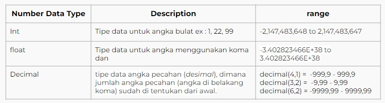

# Database  
Database adalah kumpulan terorganisir dari informasi terstruktur, atau data, biasanya disimpan secara elektronik dalam sistem komputer. Sebuah database biasanya dikendalikan oleh sistem manajemen database (DBMS). Bersama-sama, data dan DBMS, bersama dengan aplikasi yang terkait dengannya, disebut sebagai sistem basis data, sering disingkat menjadi basis data saja.  
Data dalam tipe database paling umum yang beroperasi saat ini biasanya dimodelkan dalam baris dan kolom dalam serangkaian tabel untuk membuat pemrosesan dan kueri data menjadi efisien. Data kemudian dapat dengan mudah diakses, dikelola, dimodifikasi, diperbarui, dikendalikan, dan diatur. Sebagian besar database menggunakan bahasa kueri terstruktur (SQL) untuk menulis dan meminta data.  

 

### Database Management System  
Sebuah database biasanya memerlukan program perangkat lunak database yang komprehensif yang dikenal sebagai sistem manajemen database (DBMS). Sebuah DBMS berfungsi sebagai antarmuka antara database dan pengguna akhir atau program, memungkinkan pengguna untuk mengambil, memperbarui, dan mengelola bagaimana informasi diatur dan dioptimalkan. DBMS juga memfasilitasi pengawasan dan pengendalian basis data, memungkinkan berbagai operasi administratif seperti pemantauan kinerja, penyetelan, serta pencadangan dan pemulihan.  

   

 

### MySQL  
MySQL adalah sistem manajemen basis data relasional open source berbasis SQL. Itu dirancang dan dioptimalkan untuk aplikasi web dan dapat berjalan di platform apa pun. Sebagai persyaratan baru dan berbeda muncul dengan internet, MySQL menjadi platform pilihan untuk pengembang web dan aplikasi berbasis web.  

 

### Data type SQL  
**Number**  
Tipe data Number adalah data yang berisi kumpulan karakter angka  

 

 

**String**  
Tipe data string adalah tipe data berupa kumpulan karakter termasuk karakter simbol  

   

 

**Boolean**  
Tipe ini hanya menyimpan 2 tipe data yaitu TRUE dan FALSE, dan dapat di convert menjadi int dengan representasi TRUE = 1, dan FALSE = 0  

 

**Data Time**  
Tipe ini merupakan tipe data untuk menyimpan tanggal dan waktu

  

 

**Other data type**  

   

 

### Key  
**Primary Key**  
Primary Key disebut juga dengan Kunci Primer. Kunci Primer tersebut dipilih sebagai identifikasi untuk membedakan satu baris dengan baris lainnya dalam suatu tabel. Pada dasarnya, setiap tabel hanya memiliki satu primary key saja.  

  

 

**Foregn Key**  
foreign key dapat diartikan sebagai kunci asing. Definisi tersebut juga berlaku dalam pengolahan relasional database. Kunci asing (Foreign Key) adalah sebuah atribut atau gabungan atribut yang terdapat dalam suatu tabel yang digunakan untuk menciptakan hubungan (relasi) antara dua tabel.   