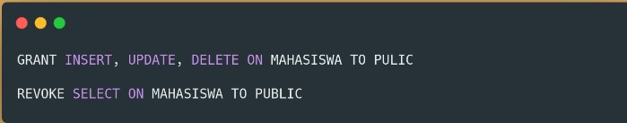
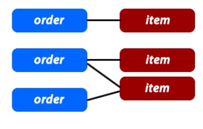
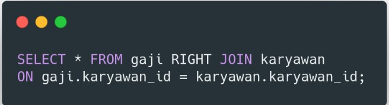

# Database Intro  
Database adalah kumpulan informasi yang disimpan didalam komputer secara sistematik dan saling berelasi.  
Database merupakan sekumpulan tabel yang berisikan informasi untuk diolah yang kemudian data tersebut bisa digunakan di dalam sebuah sistem.  
Untuk membuat Database diperlukan sebuah software yang dinamakan dengan DBMS(Database Management System)  

 

### Database Management System  
DBMS adalah software yang dapat digunakan oleh user untuk berkomunikasi dengan data yang ada dalam media penyimpanan.  

  

Tipe utama pada Database management System antara lain, Hierarchical, Network, Relational, Non Relational, and Object Oriented.  

 

### Istilah pada Database  
**Table**  
Table adalah kumpulan value yang dibangun oleh baris dan kolom, yang didalamnya berisikan atribut dari sebuah data.  

  

 

**Field**  
Field adalah kolom dari sebuah tabel dimana masing-masing field memiliki tipe data masing-masing.  

   

 

**Record**  
Record merupakan kumpulan nilai yang saling terkait. Record merupakan isi dari sebuah tabel.

  

  

 

**SQL**  
SQL atau Structured Query Language merupakan suatu bahasa (Language) yang digunakan untuk mengakses database.  
SQL adalah Bahasa Query yang digunakan untuk melakukan interaksi di RDMS (Relational Database Management System)  
* Membuat, Menampilkan dan menghapus data didalam database.  
* Mengatur “Permission” (siapa saja yang bisa mengakses data).  
* Membuat dan menghapus Database.  

 

**DDL**  
DDL merupakan kumpulan perintah SQL yang digunakan untuk membuat, mengubah dan menghapus struktur dan definisi metadata dari objek-objek Database.

   

 

**Alter**  
Alter digunakan untuk mengubah struktur dari tabel yang ada, seperti untuk menambahkan atau menghapus kolom/field.  
Membuat atau menghapus primary key, mengubah jenis kolom/field yang ada, juga mengubah kolom atau nama tabel.

  

 

**Drop**  
Perintah Drop digunakan untuk menghapus Database, Table, dan View atau Index.  

  

 

**Select**
Perintah SELECT digunakan untuk menyeleksi data berdasarkan syarat yang diberikan.  
Dengan menggunakan perintah SELECT ini record didalam tabel tertentu yang berjumlah ribuan bahkan jutaan dapat ditampilkan.

  

 

**Insert**  
INSERT	digunakan untuk memasukkan data ke kolom-kolom yang terdapat pada tabel/view.

  

 

**Where, And, Or, Not, Like**  

  

  

 

 

**Update**  
UPDATE digunakan untuk melakukan editing pada isi dari kolom (field) yang dipilih. Hal ini dilakukan untuk memperbaiki data lama / terjadi kesalahan.

 

 

**Delete**  
DELETE digunakan untuk menghapus data dalam tabel yang menjadi target.

  

 

**Grant**  
GRANT digunakan untuk memberikan hak akses pada user.  

 

**Revoke**  
REVOKE digunakan untuk mencabut hak akses yang telah diberikan pada user.  

  

 

**Database Relationships**  
Database relationship adalah relasi atau hubungan antara beberapa tabel dalam bahasa yang kita miliki.  
Relasi antar tabel dihubungkan oleh Primary key dan foreign key  
Primary key adalah atribut yang tidak hanya mengidentifikasi secara unik suatu kejadian, tapi juga mewakili setiap kejadian suatu entitas.

  

  

>Membuat tabel customers dengan customers_id sebagai Primary Key  

Foreign key adalah atribut yang melengkapi relationship dan menunjukan hubungan antara tabel induk dengan tabel anak.  

 

Beberapa tipe database relationships:  
* One To One Relationships  
* One to Many and Many to One Relationships  
* Many to Many Relationships  
* Self Referencing Relationships  

 

### One to One Relationships  

  

>Kita bisa membuat 1 tabel baru bernama adresses, yang berisi address_id dan adress. Dimana adress_id yang berada di tabel SISWA dan tabel ADRESSES saling berhubungan. Address_id disini sebagai Foreign Key.

  

>Visualisasi hubungan antara isi tabel SISWA dengan ADDRESS.  

 

### One To Many and Many to One Relationships  
One to Many and Many to One relationships adalah yang paling sering digunakan, contohnya pada e-commerce website.  
Dimana pada kasusnya:  
* Customers dapat mengorder barang.  
* Order dapat menyimpan banyak item.  
* Item bisa memiliki deskripsi.

  

>Setiap customer bisa saja memiliki 1 atau lebih pesanan. Tetapi pesanan pasti merujuk kepada 1 customer  

  

>Visualisasi hubungan antara tabel customer dengan order 

 

### Many to Many Relationships  
Secara sederhana Many to Many mempunyai pengertian “suatu baris atau lebih pada data tabel pertama dihubungkan ke satu atau lebih baris data pada tabel kedua.”

  

>ITEMS_ORDERS tabel dibuat hanya bertujuan untuk membuat hubungan “Many to Many” antara ITEMS, dan ORDERS

 

 

### SQL Table Join  
Join, adalah penggabungan tabel yang dilakukan melalui kolom/key tertentu yang memiliki nilai terkait untuk mendapatkan satu set data dengan informasi lengkap.

  

* Inner Join : menampilkan data hanya yang sesuai di kedua tabel.

  

* Left Join :  
menampilkan semua data sebelah kiri dari tabel yang di joinkan dan menampilkan data sebelah kanan yang cocok dengan kondisi join. Jika tidak ditemukan kecocokan, maka akan di set NULL secara otomatis.

  

* Right Join  
menampilkan semua data sebelah kanan dari tabel yang di joinkan dan menampilkan data sebelah kiri yang cocok dengan kondisi join. Jika tidak ditemukan kecocokan, maka akan di set NULL secara otomatis.

   

 

### NoSQL  
Database NoSQL adalah database yang tidak memiliki perintah SQL.  
Konsep penyimpanannya semi struktural atau tidak struktural, dan tidak harus memiliki relasi layaknya tabel-tabel MySQL.  
Tujuan dari penggunaan database noSQL adalah untuk model data spesifik dan memiliki skema fleksibel dalam mengembangkan aplikasi modern, contoh: aplikasi yang bersifat real time.  

 

### Kelebihan NoSQL di banding Relasional Database.  
* NoSQL bisa menampung data yang terstruktur, semi terstruktur dan tidak terstruktur.  
* Menggunakan OOP dalam pengaksesan/manipulasi data.  
* NoSQL tidak mengenal schema tabel yang kaku.  

 

### Document Database  
Document adalah salah satu dari beberapa model database NoSQL.  
Mendefinisikan database sebagai dokumen artinya penyimpan data dan proses manipulasinya dalam bentuk Objek dokumen.

  

Contoh objek dokumen yang sering diterapkan dalam pemrograman adalah format JSON.