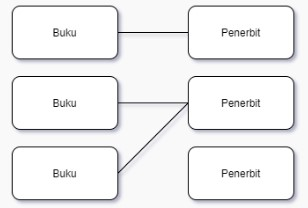
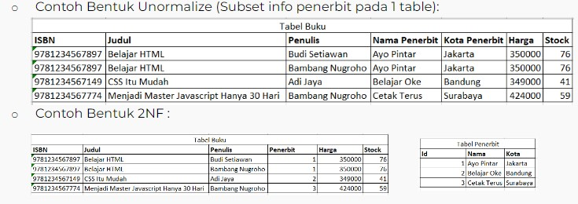

# My SQL Lanjutan  

### Relations di SQL  
**One to Many**  
* Paling Sering Digunakan  
* Satu baris dalam tabel dapat memiliki beberapa baris di table relasinya  

   

 

**Many to many**  
* Digunakan ketika kedua tabel yang berelasi dapat memiliki beberapa baris di tabel relasinya.  

   

 

**One to One**  
* Sangat jarang digunakan  
* Diimplementasikan dengan cara yang sama seperti One to Many tetapi dengan kondisi tambahan (foreign key merupakan primary key)  

  

 

### Database Normalization  
Merupakan teknik analisis data yang mengorganisasikan atribut-atribut data dengan cara mengelompokkan sehingga terbentuk entitas yang non-redundant, stabil, dan fleksible.  
Tujuan :  
* Menghilangkan redundan data pada database.  
* Memudahkan juka ada perubahan struktur table database  
* Memperkecil pengaruh jika ada perubahan dari struktur table database.  

Efek Jika Tidak Melakukan Database Normalization :  
* INSERT Anomali :   
Situasi dimana tidak memungkinkan memasukkan beberapa jenis data secara langsung di database.  
* DELETE Anomali :   
Penghapusan data yang tidak sesuai dengan yang diharapkan, artinya data yang harusnya tidak terhapus mungkin ikut terhapus  
* UPDATE Anomali :   
Situasi dimana nilai yang diubah menyebabkan inkonsistensi database, dalam artian data yang diubah tidak sesuai dengan yang diperintahkan atau yang diinginkan.  

Bentuk Database Normalization :  
**First Normal Form (1NF)**  
* Menghilangkan multiple value pada sebuah kolom table database  
* Sebuah table memenuhi kaidah 1NF jika :  
Setiap kolom bernilai tunggal (single value), Setiap kolom memiliki nama yang unik, Urutan penyimpanan data tidak menjadi masalah  

  

 

**Second Normal Form (2NF)**  
* Harus sudah dalam bentuk 1NF untuk mendapatkan 2NF  
* Menghapus beberapa subset data yang ada pada tabel dan menempatkan mereka pada tabel terpisah  

  

 

**Third Normal Form (3NF)**  
Menghilangkan seluruh atribut atau field yang tidak berhubungan dengan primary key. Dengan demikian tidak ada ketergantungan transitif pada setiap kandidat key.  

 

### Keys di SQL  
**Super Key**  
* Kumpulan dari satu atau lebih dari satu key yang dapat digunakan untuk mengidentifikasi record secara unik dalam sebuah tabel.  
* Super Key adalah superset dari Candidate Key.  

 

 

**Candidate Key**  
* kumpulan satu atau lebih fields/columns yang dapat mengidentifikasi record secara unik dalam tabel.  
* Bisa jadi ada beberapa Candidate Keys di dalam satu tabel  
* Setiap Candidate Key bisa digunakan sebagai Primary Key.  
* Candidate Key adalah super key yang tidak mempunyai value yang berulang

 

>Pada table ini yang menjadi candidate key adalah ISBN karena tidak ada value yang berulang.  

 

**Primary Key**  
* kumpulan satu atau lebih fields/columns dari sebuah tabel yang secara unik mengidentifikasi sebuah record dalam tabel database.  
* Valuenya tidak boleh berupa null ataupun duplicate value.  
* Hanya boleh salah satu Candidate Key yang bisa menjadi Primary Key.

  

>Pada table diatas bisa dipilih antara id dan ISBN bisa menjadi primary key  

 

**Alternate Key**  
* key yang bisa digunakan menjadi primary key.  
* Pada dasarnya, Key ini merupakan candidate key yang tidak dijadikan  primary key.

  

> Jika kita sudah menentukan id sebagai primary key, maka ISBN menjadi alternate key  

 

**Unique Key**  
* Kumpulan dari satu atau lebih fields/columns di sebuah table database yang secara unik mengidentifikasi sebuah record dalam table database tersebut.  
* Hampir sama dengan Primary key, namun value dari Unique Key bisa berupa satu buah null value di dalam sebuah table database, dan Unique Key tidak bisa memiliki duplicate values  

  

>Pada table ini yang menjadi unique key adalah ISBN, karena nilai ISBN tidak boleh duplicate.  

 

**Foreign Key**  
* Field di sebuah table database yang menjadi Primary Key di table database lain.  
* Value dari Foreign key bisa menerima multiple null dan duplicate values.

   

> Pada table penerbit, primary key adalah kolom Id.  
>Pada table buku, foregn key adalah kolom penerbit.  

 

**Join Multiple Tables**  
Mengambil records dari dua atau lebih table database yang memiliki relationship dan akan di sajikan dalam single result set.  

 

**INNER JOIN**  
* Semua baris akan diambil dari kedua table yang akan di JOIN, selama columns cocok dengan kondisi yang sudah di tentukan.  
* Memungkinkan baris dari salah satu tabel muncul di hasil jika dan hanya jika kedua tabel memenuhi kondisi yang ditentukan dalam klausa ON.  

 

**LEFT JOIN**  
* Pada JOIN ini, semua records dari table di sisi kiri JOIN statement akan di pilih.  
* Jika record yang di pilih dari table kiri tidak memiliki record yang cocok pada table JOIN yang kanan, maka record tersebut masih dipilih, dan kolom pada table yang kanan akan bernilai NULL. 

 

**RIGHT JOIN**  
Pada JOIN ini, semua records dari table di sisi kiri JOIN statement akan di pilih, bahkan jika table di sebelah kiri tidak memiliki record yang cocok.
