# Sequelize  
Sequelize adalah ORM (Object Relational Mapping) Node JS yang berbasis promise. Sequelize mendukung sebagian besar relational Database seperti MySQL, PostgresQL, MariaDB, SQLite dan Miscrosoft SQL Server.  
Dengan fitur fitur di Sequelize, kita bisa mengelola dan mengatur data di database kita dengan cepat, dan efisien.  

 

### ORM  
ORM adalah suatu metode/teknik pemrograman yang digunakan untuk mengkonversi data dari lingkungan bahasa pemrograman berorientasi objek (OOP) dengan lingkungan database relational.  

 

## Generate Swquelize  
**Sequelize init**  
Pertama kita perlu melakukan inisialisasi di project kita terlebih dahulu agar dapat melakukan generate code  

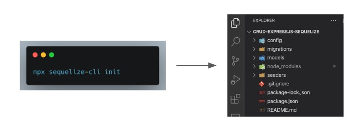    

 

>setting database

**Generate Model**

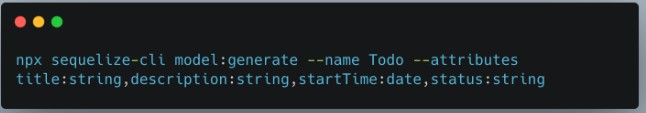  

>membuat table todo dengan field

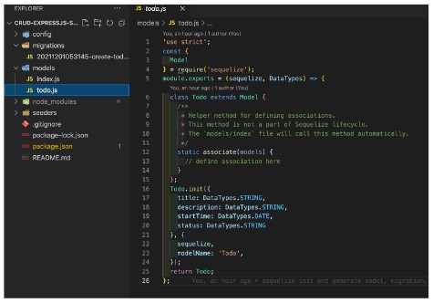  

>Kita bisa melihat datanya menjadi sebuat class (OOP) dan dapat kita gunakan untuk membuat Rest API menggunakan express atau dapat memberikan behaviour di statenya

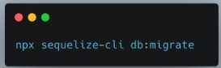  

>Akhirnya kita dapat menggunakan generate dan kita bisa mengecek ke database sehingga dapat kita gunakan untuk penimpanan DB

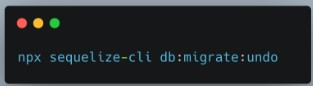 

>Jika ada yang salah, kita bisa mengembalikan (undo) menggunakan :

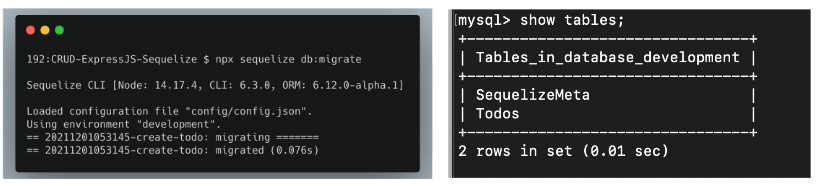  

>Ketika kita berhasil melakukan generate maka kita dapat melihat di database ada 1 table baru yang bernama Todos dan ada table SequelizeMete  

 

**Generate Seed**  
Seed adalah data awal yang bisa kita gunakan untuk mengisi data di database untuk keperluan awal project menggunakan sequelize

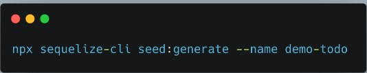  

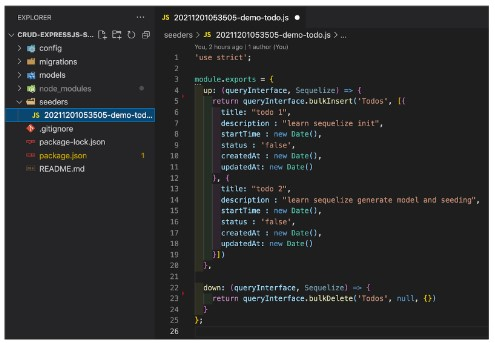 

>Ketika sudah berhasil melakukan generate maka kita dapat melakukan pengisian data seed didalam file seed generator. Terdapat 2 data yang diisi yaitu “up” untuk mengisi data di db, dan “down” untuk drop atau menghapus semua data seed di db  

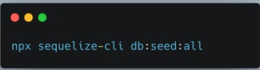  

>Kita kemudian menjalankan generate seed menggunakan sequelize 

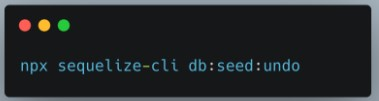  

>Jika ada yang salah, kita bisa mengembalikan (undo) menggunakan

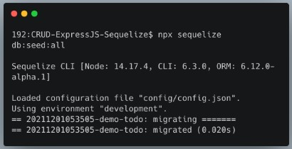  

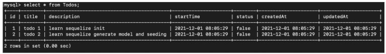 

>Ketika kita menjalankan generate seed menggunakan terminal, maka kita dapat melihat bahwa seeding kita sudah berhasil ter insert ke db  

 

### Membuat CRUD Dengan Express dan Sequelize  
Setelah Model tersedia, maka model tersebut bisa kita gunakan untuk membuat CRUD.  
Beberapa endpoint RESTFul :  
* Get All Todos  
* Get Todo Detail By Id  
* Create New Todo  
* Update Todo By Id  
* Delete Todo